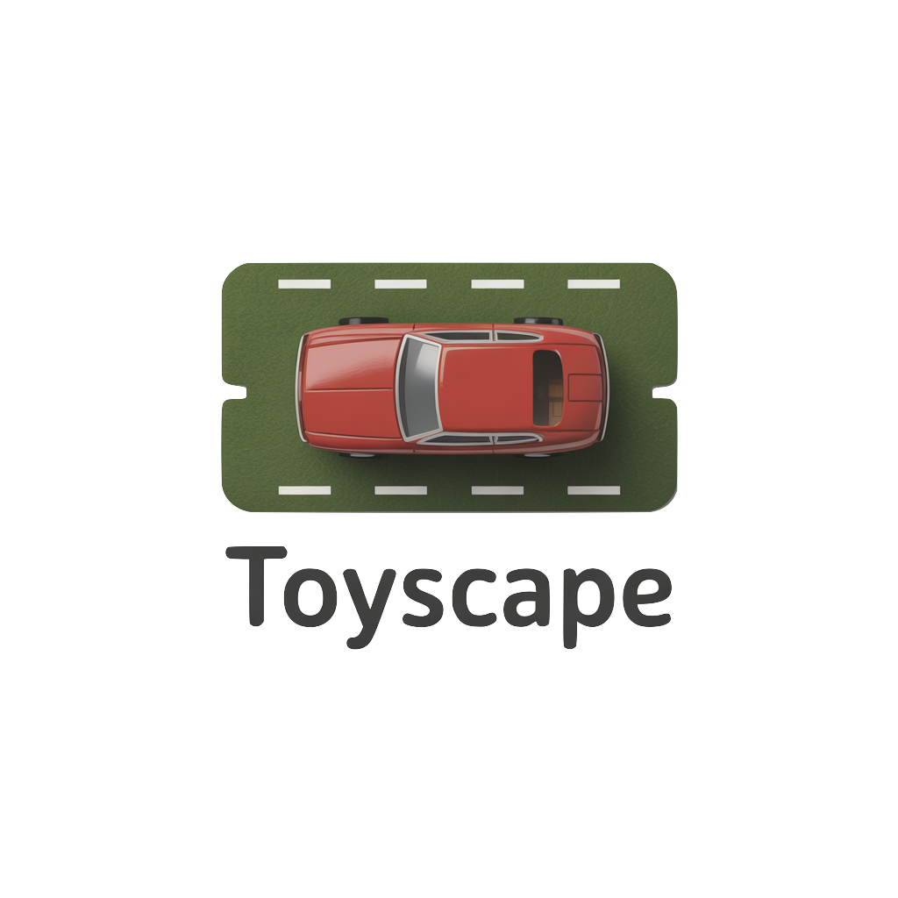

<p align="center">
  
</p>

<h1 align="center">Toyscape</h1>

<p align="center">
  <strong>The screen is the stage. The toy is the star.</strong>
</p>

<p align="center">
  <a href="https://harryherbig.github.io/digitale-spielmatte/">Live Demo</a>
</p>

---

Toyscape turns any tablet into a living playmat. Lay it flat on the table, place a Matchbox car on the screen, and push it down the road. The hospital makes siren sounds when you tap it. The garage gate opens. The crossroad clicks through red, yellow, green.

It's not a game. There's no score, no levels, no right way to play. It's a reactive stage for the real toys already in your child's hands — a world that responds when they arrive.

## How it works

The tablet lies flat on a table. The screen shows a world — roads, buildings, a helipad. The child places real toys directly on the display and pushes them around.

**Edit Mode** — A parent builds the world. Drag road tiles, place a hospital, lay out a parking lot. Rotate pieces to connect them. The layout saves automatically.

**Play Mode** — The child plays. Empty cells fill with grass. Grid lines disappear. Everything becomes a seamless surface. A lock button keeps the world safe from accidental edits — the child touches the screen freely without breaking anything.

Tap the hospital, hear a siren. Tap a crossroad, the light changes. Every tile has a sound. No instructions needed — tap a thing, it reacts.

## What this is (and isn't)

Toyscape creates a category we call **Interactive Play Surface**. It sits between physical toys and digital apps, belonging fully to neither.

The closest analog is a playmat — but one that reacts, sounds, animates, and shifts from day to night.

Kids' apps like Toca Boca are self-contained digital worlds. Toyscape is just the backdrop for real toys. Products like Osmo or Tonie require proprietary hardware. Toyscape works with the Matchbox car already on the floor.

**The toy is the hero.** If the child looks more at the screen than at their toy, we've failed. The screen is infrastructure — like a stage is infrastructure for actors.

## Design principles

**Together on the floor.** Built for a parent and child playing side by side. The parent builds the world, the child plays in it. Toyscape is the bridge that keeps shared play going when the parent runs out of sound effects.

**No instructions needed.** A 2-year-old can't read. A tired parent doesn't want to. Everything is obvious at first glance: drag a tile, it snaps. Tap a building, it responds. Icons only, no text labels.

**Open-ended, always.** There is no winning, no losing, no correct layout. The child decides where the ambulance goes, whether the helicopter lands on the pad or on the street, whether the parking garage is actually a dragon's cave. We provide the scenery. They provide the story.

## Built with

A single `index.html` file. No build step. No dependencies. No framework.

| Layer | Approach |
|---|---|
| **Layout** | CSS Grid — 10×14 tile grid, each cell one square tile |
| **Tiles** | PNG images (`assets/`) placed via drag-and-drop, rotated with CSS `transform` |
| **Pan & Zoom** | CSS `transform: translate() scale()` on a wrapper div. Pinch-to-zoom on touch, scroll-wheel on desktop |
| **Sound** | Web Audio API — all sounds synthesized with oscillators, noise buffers, and filters. No audio files. Siren is a frequency sweep, rotor is a pulsed sawtooth, barrier is filtered noise + beep |
| **Persistence** | `localStorage` — grid state (tile type + rotation per cell) saved on every change, restored on load |
| **Touch** | Pointer Events API for unified touch/mouse. `preventDefault` on all touch events to block browser zoom/scroll. Single-finger taps interact, two-finger gestures navigate |
| **Night mode** | CSS `filter: brightness()` on tile images, class toggle on viewport |

### Tile system

Tiles are square PNGs designed so road exits align at the center of each edge. Place a vertical road next to a curve (rotated correctly) and they connect seamlessly.

Available tiles:

| Tile | File | Purpose |
|---|---|---|
| Grass | `ground_grass.png` | Default ground fill |
| Straight road | `road_vertical.png` | Road segment, rotate for horizontal |
| Curved road | `road_curved.png` | 90° turn, rotate to change direction |
| Crossroad | `road_crossroad.png` | Four-way intersection |
| Hospital | `building_hospital.png` | Building with driveway |

### Sound design

Every sound is built from scratch with the Web Audio API:

- **Siren** — Sine oscillator sweeping 400→800→400 Hz, three cycles over 2.5 seconds
- **Rotor** — Sawtooth at 55 Hz, amplitude-modulated by a square-wave LFO at 18–26 Hz
- **Barrier** — Bandpass-filtered white noise (servo whirr) followed by an 880 Hz sine beep
- **Click** — Square wave from 1500 Hz decaying to 200 Hz in 30ms
- **Parking beep** — Ten 1000 Hz sine pips with quadratically decreasing intervals
- **Ticket** — Square wave at 300 Hz, frequency-modulated by a 40 Hz square LFO

## Running locally

```
git clone https://github.com/harryherbig/digitale-spielmatte.git
open index.html
```

No server needed. Just a browser.

## Target

Children aged 2–4 and their parents. The tablet on the table. The Matchbox car on the screen. The story in the child's head.

---

<p align="center">
  <em>The playmat that plays back.</em>
</p>
